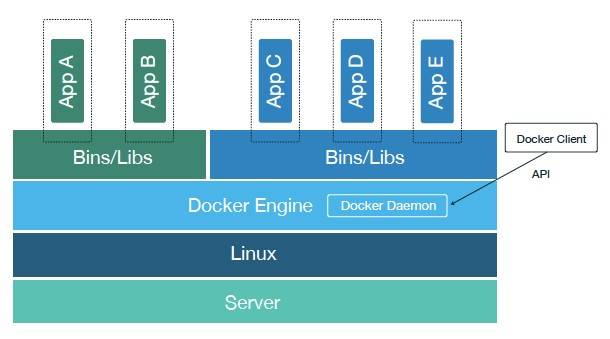
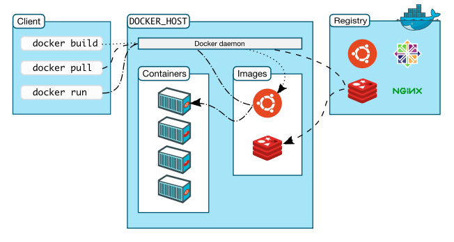

## 学习目录

* Docker 概述
* Docker 安装
* Docker 命令
  * 镜像命令
  * 容器命令
  * 操作命令
  * 其他命令

* Docker 镜像 
* Docker 容器数据卷
* DockerFile
* Docker 网络原理
* Idea 开发工具整合 Docker 
* Docker Compose
* Docker Swarm 
* CI/CD jekins 持续集成

# 1. Docker 概述

## 1.1 什么是 Docker ？

Docker 是一个开放源代码软件项目，项目主要代码在2013年开源于 [GitHub](https://github.com/moby/moby)。它是云服务技术上的一次创新，让应用程序布署在软件容器下的工作可以自动化进行，借此在 Linux 操作系统上，提供一个额外的软件抽象层，以及操作系统层虚拟化的自动管理机制。

Docker 利用 Linux 核心中的资源分脱机制，例如 cgroups，以及 Linux 核心命名空间（name space），来创建独立的软件容器（containers），属于操作系统层面的虚拟化技术。由于隔离的进程独立于宿主和其它的隔离的进程，因此也称其为容器。Docker 在容器的基础上进行了进一步的封装，从文件系统、网络互联到进程隔离等等，极大的简化了容器的创建和维护，使得其比虚拟机技术更为轻便、快捷。Docker 可以在单一 Linux 实体下运作，避免因为创建一个虚拟机而造成的额外负担。

Docker 是一种“容器即服务”（Docker Containers as a Service ，简称 CaaS），使得开发和IT运营团队可以对于应用的构建、发布、运行更加敏捷和可控。

Docker 是一个应用程序开发、部署、运行的平台，使用 go 语言开发。相较于传统的主机虚拟化，Docker 提供了轻量级的应用隔离方案 并且为我们提供应用程序快速扩容、缩容的能力。

Docker 和 虚拟机的区别与特点，对于虚拟机技术来说，传统的虚拟机需要模拟整台机器包括硬件，每台虚拟机都需要有自己的操作系统，虚拟机一旦被开启，预分配给他的资源将全部被占用。每一个虚拟机包括应用，必要的二进制和库，以及一个完整的用户操作系统，如 「图 1-1-1-1」所示。

【图 1-1-1-1】

容器技术和我们的宿主机共享硬件资源及操作系统，可以实现资源的动态分配。容器包含应用和其所有的依赖包，但是与其他容器共享内核。容器在宿主机操作系统中，在用户空间以分离的进程运行。容器内没有自己的内核，也没有进行硬件虚拟，如 「图 1-1-1-2」所示。

【图 1-1-1-2】

## 1.2  Docker Engine

Docker Engine可以安装到任何一个运行LinuxOS的物理机、虚拟机及便携电脑之上或者数据中心里、云服务提供者的服务器上。Docker的容器模型允许多个隔离的应用程序容器运行在同一个服务器上，从而更好地使用硬件资源并且降低行为异常的应用程序对于其他应用程序及物理主机的影响。Docker容器是基于应用程序的映像而创建的，而这些映像是由一个称之为Docker Hub的注册机（registry）负责存储、管理与发布。在Docker Hub上有对Docker用户开放且来自社区和生态系统的公共、私有及官方映像仓库。

【图 1-1-2-1】

Docker Engine 使用客户端－服务器（client-server / CS）架构，包含了三个主要部分：dockerd守护进程、REST API接口层、cli接口层(管理容器、镜像、网络、存储等等) ，如图 「图 1-1-2-2」 所示。一个 Docker 客户端与 Docker Engine 的守护进程通信，该守护进程负责为一个特定的应用程序服务完成构建、分发和运行 Docker 容器的所有繁重工作。Docker 客户端可以是运行的一个命令行工具或者通过 DockerAPI 集成到第三方应用程序中。客户端和守护进程可以运行在相同的系统中，但是客户端也可以远程地访问DockerEngines。所有客户端与守护进程之间的通讯可以使用 TLS 进行防护并且借助 RESTfulAPI 来实现。Docker 是使用 Go 语言开发的，守护进程使用多个库和内核功能来实现它的设计目标。

【图 1-1-2-2】

## 1.3  Docker 架构

Docker 采用的是 CS（Client-Server） 架构，Docker Client 通过 RESTful API 访问 Docker Daemon 进行 socket 通信 。Docker Daemon 负责 完成镜像的拉取、构建 及容器的发布、运行管理。

【图 1-1-3-1】

## 1.4 Docker Daemon

如上图「图1-1-3-1」所示，Docker Daemon （Docker 守护进程）在主机上运行，用户不能直接和 Docker Daemon 打交道，但是可以通过 Docker Client 与其交互。

Docker 守护进程负责 监听 API 的请求，并且管理 docker 对象，包括 镜像、容器、网络、存储、数据卷等。不同守护进程进程之间互相通信，从而构成集群服务。

## 1.5 Docker Client

Docker 客户端 是 Docker 的初始用户界面，它接收用户的命令并反馈，并且与Docker的守护进行交互。

## 1.6 Docker 镜像

Docker 镜像是一个只读的模版，相当于一个包含安装了 Apache Web 服务应用的 Linux 系统 镜像，镜像可以用来创建 Docker 容器。Docker 提供了 构建新的镜像或升级原有镜像的便利方式，或者也可以下载 别人 已经创建好的镜像。

我们已经知道 Docker 镜像实质上是一些用于加载 Docker 容器的只读模板，每个镜像包括很多层。Docker利用 [union file systems](http://en.wikipedia.org/wiki/UnionFS) 将这些层组合为一个镜像。Union file systems允许相互隔离的文件或目录透明的叠加在一起，而呈现为一个统一的文件系统

Docker 如此轻量化的原因也是由于这些层的存在。当你对一个Docker镜像进行修改时——例如将一个应用升级为一个新的版本——会构建一个新的层，因此，与虚拟机的替换整个镜像或完全构建的方式不同，Docker仅对相关的层进行添加或升级。所以你仅需要发布镜像的更新部分而不必发布整个镜像，这种方式使得镜像的发布更加快速和简单。

【图 1-1-6-1】

## 1.7 Docker 容器

Docker容器就像是一个文件夹，它包含了一个应用程序运行所需要的所有内容。每个容器都是基于Docker镜像构建。我们可以运行、开始、停止、迁移或者是删除 Docker 容器。每个容器均是一个隔离的、安全的应用平台。Docker 镜像是只读的，当Docker从一个镜像运行一个容器时，它会在镜像的上层添加一个用于运行应用的可读写的层（利用的就是上文提到的union file system），如图 「图1-1-6-1」所示。

一个容器包括操作系统、用户添加的文件以及相关的元数据。我们知道，每个容器都是从镜像中构建出来的，这个镜像告诉 Docker 容器用到什么资源，当容器加载时 启动那个进程以及容器启动时的其他配置。

如果销毁了一个容器，所有对容器的变更也会丢失，除非你提交了你的变更。提交变更作为一个新的层将追踪并审计对基础映像的变更，它可以作为在Docker Hub 中存储的一个新镜像进行发布而且可以在一个容器中运行。这个审计线索对于提供信息来于保持合规而言是很重要的。当一个容器被破解或者发现漏洞，它也能够快速且方便地回滚到以前的版本。为了程序的运行，只有很少的几个核心 Linux 内核文件系统不得不用在容器环境中。大多数这些强制性的文件，诸如/sys和其他 /proc 下的文件，是以只读的方式进行挂载。这进一步限制了可能对它们进行写操作的访问能力，即使是有权限的容器进程也是如此。

## 1.8 Docker 仓库

镜像构建完成后，可以很容易的在当前宿主机上运行，但是，如果需要在其它服务器上使用这个镜像，我们就需要一个集中的存储、分发镜像的服务，Docker Registry 就是这样的服务。一个 Docker Registry 中可以包含多个仓库；每个仓库可以包含多个标签；每个标签对应一个镜像，其中标签可以理解为镜像的版本号。


## 1.9 命名空间（namespaces）

Docker 为容器提供一个隔离的工作空间，用到了`命名空间`的技术。当你运行一个容器时，Docker 会为此容器创建一组命名空间，以此每个容器运行在自己的命名空间中，而外部不能访问这个层。

Docker用到的一些命名空间有：

* **`pid`命名空间**: 用于隔离进程（PID：Process ID）
* **`net`命名空间**: 用于管理网络
* **`ipc`命名空间**: 用于访问IPC资源（IPC：InterProcess Communication）
* **`mnt`命名空间**: 用于管理挂载点（MNT：Mount）
* **`uts`命名空间**: 用于隔离内核和版本标识（UTS：Unix Timesharing System）

## 1.10 控制组（Control Groups）

Docker 还用到了 另外一项技术叫 cgroups 或者叫控制组（Control Groups）。实现程序运行环境隔离的关键 ，在于使这些程序只用到它们需要的资源，就能够保证这些容器在主机服务环境良好运行。控制组允许 Docker 在不同的容器之间共享硬件资源，需要时 添加一些限制和约束，例如限制一个容器最大访问内存量。

## 1.11 Docker 的三剑客

**docker-compose**：Docker 镜像在创建之后，往往需要自己手动 pull 来获取镜像，然后执行 run 命令来运行。当服务需要用到多种容器，容器之间又产生了各种依赖和连接的时候，部署一个服务的手动操作是令人感到十分厌烦的。dcoker-compose 技术，就是通过一个 `*.yml`  配置文件，将所有的容器的部署方法、文件映射、容器连接等等一系列的配置写在一个配置文件里，最后只需要执行 `docker-compose up` 命令就会像执行脚本一样的去一个个安装容器并自动部署他们，极大的便利了复杂服务的部署。

**docker-machine**：Docker 技术是基于 Linux 内核的 cgroup 技术实现的，那么问题来了，在非 Linux 平台上是否就不能使用 docker 技术了呢？答案是可以的，不过显然需要借助虚拟机去模拟出 Linux 环境来。docker-machine 就是 docker 公司官方提出的，用于在各种平台上快速创建具有 docker 服务的虚拟机的技术，甚至可以通过指定 driver 来定制虚拟机的实现原理（一般是 virtualbox）。

**docker-swarm**：swarm 是基于 docker 平台实现的集群技术，他可以通过几条简单的指令快速的创建一个 docker 集群，接着在集群的共享网络上部署应用，最终实现分布式的服务。


# 2. Docker 安装


## 2.1 [CentOS 系统安装 Docker](https://docs.docker.com/engine/install/centos/)

### 2.1.1  先决条件

在安装 Docker 之前，首先必须确保当前 CentOS 系统版本必须在 CentOS 7.x 以上 才能被支持安装。

```shell
cat /etc/issue # cat 是英文单词 concatenate 的缩写，cat命令可以用来显示、合并文件。etc  初期etc的英文名字缩写为 etcetera ，后来大家更习惯称为 Editable Text Configuration。ETC为系统配置文件目录，该目录包含系统启动脚本、启动配置文件、用户登陆配置文件、网络配置文件、httpd 配置文件、IPSec 配置文件和其他文件等。
```

```shell
cat /proc/version # proc 为process的缩写，里面存放与内核相关的文件
```

```shell
uname -a # 查看已经安装的 CentOS 版本信息
```

必须启动 centOS-extras 存储库。该储存库默认情况下是启用状态，如果已禁用它，则需要重新启用它

### 2.1.2 安装步骤

#### 1. 卸载旧的版本

较旧的 Docker版本称为 docker 或 docker-engine。如果已安装这些程序，需要卸载它们以及相关的依赖项。但是 原来 旧的 /var/lib/docker/ 的内容（包括镜像，容器，卷和网络）被保留。Docker Engine 软件现在称为 docker-ce。

如果 yum 报告没有安装这些软件，那就可以了。

```shell
# 卸载旧的版本
$ sudo yum remove docker \
                  docker-client \
                  docker-client-latest \
                  docker-common \
                  docker-latest \
                  docker-latest-logrotate \
                  docker-logrotate \
                  docker-engine
```

#### 2. 使用仓库安装

在 新主机上 首次安装 Docker Engine 之前，需要设置 Docker 存储库。之后，就可以从存储库安装和更新docker。

安装 yum-utils 软件包（提供yum-config-manager实用程序）并设置稳定的存储库。

```shell
$ sudo yum install -y yum-utils

$ sudo yum-config-manager \
    --add-repo \
    https://download.docker.com/linux/centos/docker-ce.repo
$ sudo yum-config-manager --add-repo http://mirrors.aliyun.com/docker-ce/linux/centos/docker-ce.repo

```

> 可选：启用 nightly 或者 test 仓库
>
> 这些存储库包含在上面的 docker.repo文件中，但默认情况下处于禁用状态。可以在稳定存储库旁边启用它们。以下命令启用  nightly 存储库。
>
> ```shell
> $ sudo yum-config-manager --enable docker-ce-nightly
> ```
>
> 要启用测试通道，请运行以下命令。
>
> ```shell
> $ sudo yum-config-manager --enable docker-ce-test
> ```
>
> 可以通过运行带有 --disable 标志的 yum-config-manager 命令来禁用 nightly 或 test 存储库。要重新启用它，请使用--enable标志。以下命令禁用 nightly 存储库。
>
> ```shell
> $ sudo yum-config-manager --disable docker-ce-nightly
> ```
>
> [Learn about **nightly** and **test** channels](https://docs.docker.com/engine/install/).

#### 3. 安装 Docker Engine

安装特定版本的 Docker Engine，可以存储库中列出可用版本，然后选择并安装

```shell
# 返回的列表取决于启用的存储库，并且特定于的 CentOS 版本（在此示例中由.el7后缀指示）
$ yum list docker-ce --showduplicates | sort -r

docker-ce.x86_64  3:18.09.1-3.el7                     docker-ce-stable
docker-ce.x86_64  3:18.09.0-3.el7                     docker-ce-stable
docker-ce.x86_64  18.06.1.ce-3.el7                    docker-ce-stable
docker-ce.x86_64  18.06.0.ce-3.el7                    docker-ce-stable
```

通过其完全合格的软件包名称安装特定版本，该软件包名称是软件包名称（docker-ce）加上版本字符串（第二列），从第一个冒号（:)开始，直至第一个连字符，并用连字符（-）分隔）。例如，`docker-ce-18.09.1`。

```shell
$ sudo yum install docker-ce-<VERSION_STRING> docker-ce-cli-<VERSION_STRING> containerd.io
```

4. 启动 Docker 

   ```shell
   $ sudo systemctl start docker
   
   $ sudo systemctl enable docker # 开机自启 docker 服务
   ```

5. 通过运行 hello-world 镜像验证 Docker Engine 是否已正确安装

   ```shell
   $ sudo docker run hello-world
   ```

#### 4. 卸载 Docker Engine

1. 卸载Docker Engine，CLI和Containerd软件包：

```shell
$ sudo yum remove docker-ce docker-ce-cli containerd.io
```

2. 主机上的映像，容器，卷或自定义配置文件不会自动删除。要删除所有图像，容器和卷：

```shell
$ sudo rm -rf /var/lib/docker
```

#### 5. 安装 docker-compose

1. 运行以下命令以下载Docker Compose的当前稳定版本

```shell
# 该下载地址太慢
$ sudo curl -L "https://github.com/docker/compose/releases/download/1.26.2/docker-compose-$(uname -s)-$(uname -m)" -o /usr/local/bin/docker-compose
# 国内的下载地址
$ sudo curl -L "https://get.daocloud.io/docker/compose/releases/download/1.26.2/docker-compose-$(uname -s)-$(uname -m)" -o  /usr/local/bin/docker-compose

```

> 如果使用curl安装时遇到问题，请参见上方的“ [Alternative Install Options](https://docs.docker.com/compose/install/#alternative-install-options) ”选项卡。

2. 将可执行权限应用于二进制文件

```shell
$ sudo chmod +x /usr/local/bin/docker-compose
```

> 注意：如果命令docker-compose在安装后失败，请检查路径。您也可以创建指向 `/usr/bin` 或路径中任何其他目录的符号链接

```she
$ sudo ln -s /usr/local/bin/docker-compose /usr/bin/docker-compose
```

3. 测试安装成功

```shell
$ docker-compose --version
docker-compose version 1.26.0, build 1110ad01
```

#### 6. 卸载 docker-compose

1. 如果使用curl 命令安装docker-compose ，卸载 Docker Compose 方式如下

```shell
$ sudo rm /usr/local/bin/docker-compose
```

## 7 docker-配置国内镜像源

### 7.1 创建或修改 `daemon.json`

> daemon.json 文件路径为：`/etc/docker/daemon.json`，使用vi或vim打开 `daemon.json`
>
> etc目录下，可能没有docker文件夹，需要手动创建：`mkdir /etc/docker`

```shell
$ vim /etc/docker/daemon.json
```

### 7.2 daemon.json配置

```json
{
 "registry-mirrors" : [
   "https://mirror.ccs.tencentyun.com",
   "http://registry.docker-cn.com",
   "http://docker.mirrors.ustc.edu.cn",
   "http://hub-mirror.c.163.com"
 ],
 "insecure-registries" : [
   "registry.docker-cn.com",
   "docker.mirrors.ustc.edu.cn"
 ],
 "debug" : true,
 "experimental" : true
}
```


