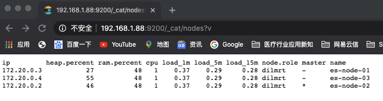
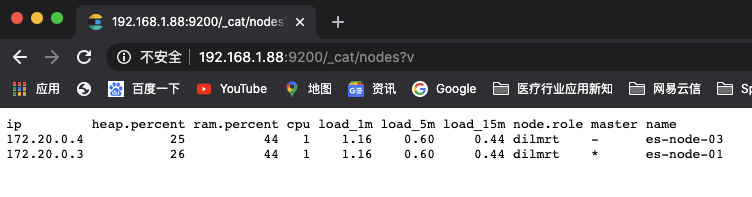
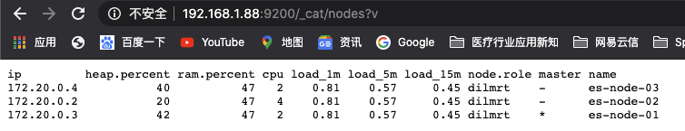

# 使用 Docker 快速部署 Elasticserach 7.8 集群

本项目中使用 Docker 容器（使用 docker-compose 编排）快速部署 Elasticsearch 集群，可用与开发环境（单机多实例）或生产环境部署

Elasticsearch 具有良好的默认设置，并且只需要很少的配置。可以使用 [Cluster update settings](https://www.elastic.co/guide/en/elasticsearch/reference/current/cluster-update-settings.html) API 在正在运行的群集上更改大多数设置。配置文件应包含特定于节点的设置（例如 node.name 和 paths），或节点为了能够加入集群而需要的设置，例如 cluster.name 和network.host。

1. 关于配置文件

   Elasticsearch具有三个配置文件：

   * `lasticsearch.yml` 用于配置Elasticsearch
   * `jvm.options` 用于配置Elasticsearch的JVM设置
   * `log4j2.properties` 用于配置 Elasticsearch 的日志记录

   这些文件位于 `config` 目录中，其默认位置取决于安装是来自归档发行版（tar.gz或zip）还是软件包发行版（Debian或RPM软件包）

   对于存档分发，配置目录位置默认为 `$ES_HOME/config`。可以通过 `ES_PATH_CONF` 环境变量来更改config目录的位置，如下所示：

   ```shell
   ES_PATH_CONF=/path/to/my/config ./bin/elasticsearch
   ```

## 1. 准备工作

### 1.1.  安装 docker 和 docker-compose

参考  [Docker 认识与安装.md](../../Docker/Docker 认识与安装.md) 和 [Docker-compose 入门.md](../../Docker/Docker-compose 入门.md) 

### 1.2. 创建数据目录

* 创建 数据/日志/插件 目录，这里我们部署3个节点

  ```shell
  mkdir /home/data/elasticsearch/data/{es-node-01,es-node-02,es-node-03} -p
  mkdir /home/data/elasticsearch/logs/{es-node-01,es-node-02,es-node-03} -p
  mkdir /home/data/elasticsearch/plugins/{es-node-01,es-node-02,es-node-03} -p
  mkdir /home/data/elasticsearch/config/{es-node-01,es-node-02,es-node-03} -p
  ```

  > /home/data/elasticsearch/xpack 为配置安全证书目录

* 创建 `elasticsearch.yml` 文件

  ```shell
  touch /home/data/elasticsearch/config/es-node-01/elasticsearch.yml
  touch /home/data/elasticsearch/config/es-node-02/elasticsearch.yml
  touch /home/data/elasticsearch/config/es-node-03/elasticsearch.yml
  ```
  
* 目录授权

  > docker-compose.yml 中配置 privileged 为 true，给予 es 同主机权限，但好像不行
  
  ```shell
  cd  /home/data/elasticsearch
  chmod 0777 data/* -R && chmod 0777 logs/* -R && chmod 0777 plugins/* -R && chmod 0777 config/* -R
  ```

### 1.3. Linux 虚拟机内核设置

>`vm.max_map_count` 设置应在 `/etc/sysctl.conf` 中永久设置

```bash
$ grep vm.max_map_count /etc/sysctl.conf
vm.max_map_count=262144
```

> 要在实时系统上应用设置，请键入

```shell
$ sysctl-w vm.max_map_count=262144
```

## 2. docker-compose 编排服务

### 2.1 创建自定义的 `network` (建议使用 swarm 集群网络适配，具体参考 [Docker 19.x 参考-创建一个Swarm.md](../../../参看文档/Docker 19.x 参考/Docker 19.x 参考-创建一个Swarm.md)

```shell
$ docker network create elasticsearch-net
```

> 创建  `elasticsearch-net` 虚拟网卡 目的是让 docker 容器能与宿主（centos7）桥接网络，并间接与外界连接

```shell
[root@localhost elasticsearch]$ docker network ls
NETWORK ID          NAME                DRIVER              SCOPE
9f74ec6b31ba        bridge              bridge              local
3394b20d4e66        elasticsearch-net   bridge              local
```

### 2.2. 创建编排文件

> [docker-compose.yml](./docker-compose.yml) 

```shell
vim docker-compose.yml
```

### 2.3. 参数配置说明

> * [ulimit 与 容器](https://www.cnblogs.com/JenningsMao/p/9209689.html)
>* [重点集群发现与配置](https://www.elastic.co/guide/en/elasticsearch/reference/current/discovery-settings.html)

```yaml
......
    environment:
      # 集群名称
      - cluster.name=baimicro-es-cluster
      # 节点名称
      - node.name=es-node-01
      # 是否主节点，默认 true
      - node.master=true
      # 是否作为数据存储节点，默认 true
      - node.data=true
      # 开启 cors 以便使用 Head 插件与 Kibana
      - http.cors.enabled=true
      - http.cors.allow-origin=*
      # 可以访问 ES 集群的 IP，0.0.0.0表示不绑定
      - network.bind_host=0.0.0.0
      # ES 集群相互通信的 IP，0.0.0.0 默认本地网络搜索
      - network.publish_host=0.0.0.0
      # 手动指定集群各个节点 TCP 数据交互地址(IP:PORT)，用于节点侦听和故障切换，默认缺省9300端口
      - discovery.seed_hosts=192.168.1.88:9300,192.168.1.89:9300,192.168.1.90:9300
      # 配置集群节点，多个地址逗号隔开
      - cluster.initial_master_nodes=es-node-01,es-node-02,es-node-03
      # 锁定进程的物理内存地址避免交换（swapped）来提高性能
      - bootstrap.memory_lock=true
      # JVM 内存大小配置
      - "ES_JAVA_OPTS=-Xms512m -Xmx512m"
    # 如果设置 bootstrap.memory_lock=true，memlock 就要配合设置如下
    ulimits:
      memlock:
        soft: -1
        hard: -1
    # 跟随 Docker 重启
    restart: always
    # volumes 配置由（:）分隔的三个字段组成，<卷名>:<容器路径>:<选项列表>
    # <卷名> ： 第一个字段，主机上的文件或目录
    # <容器路径> ： 第二个字段，容器中的文件或目录
    # <选项列表> ： 第三个字段，可选，且用逗号分隔，如：ro，consistent，delegated，cached，z 和 Z
    volumes:
      - /home/data/elasticsearch/logs/es-node-01:/usr/share/elasticsearch/logs
      - /home/data/elasticsearch/data/es-node-01:/usr/share/elasticsearch/data
      - /home/data/elasticsearch/plugins/es-node-01:/usr/share/elasticsearch/plugins
      # 可以配置挂载自己的配置文件
      - /home/data/elasticsearch/config/es-node-01/elasticsearch.yml:/usr/share/elasticsearch/config/elasticsearch.yml:ro
      - /home/data/elasticsearch/config/es-node-03/elastic-certificates.p12:/usr/share/elasticsearch/config/elastic-certificates.p12
    networks:
      - custom_net
......
networks:
  custom_net:
    external:
      name: elasticsearch-net

```

>  这里我们分别为`es-node-01/es-node-02/es-node-03`开放宿主机的`9200/9201/9202`作为`http服务端口`，各实例的`tcp数据传输`用默认的`9300`通过容器管理通信。

> 如果需要多机部署，则将`ES`的`transport.tcp.port: 9300`端口映射至宿主机`xxxx`端口，`discovery.zen.ping.unicast.hosts`填写各主机代理的地址即可

```yaml
......
      # 手动指定集群各个节点 TCP 数据交互地址(IP:PORT)，用于节点侦听和故障切换，默认缺省9300端口
      - discovery.seed_hosts=192.168.1.88:9300,192.168.1.89:9300,192.168.1.90:9300
      # 配置集群节点，多个地址逗号隔开,注意 节点名称必须和配置各个机器上节点名的一致
      - cluster.initial_master_nodes=es-node-01,es-node-02,es-node-03
......
    ports:
      - 9300:9300
......
```

## 3. 创建并启动服务

```shell
[root@localhost elasticsearch]$ docker-compose up -d # 后台启动
[root@localhost elasticsearch]$ docker-compose ps    # 查看启动进程
   Name                 Command               State                Ports              
--------------------------------------------------------------------------------------
es-node-01   /tini -- /usr/local/bin/do ...   Up      0.0.0.0:9200->9200/tcp, 9300/tcp
es-node-02   /tini -- /usr/local/bin/do ...   Up      0.0.0.0:9201->9200/tcp, 9300/tcp
es-node-03   /tini -- /usr/local/bin/do ...   Up      0.0.0.0:9202->9200/tcp, 9300/tcp

[root@localhost elasticsearch]$ docker-compose logs  # 查看启动日志
```

## 4. X-pack 安全认证配置

### 4.1. 证书

如下操作在其中一个 node 节点执行生成证书，然后同步上传到集群其他节点即可

>  [Docker 部署 Elasticsearch 单机说明.md](Docker 部署 Elasticsearch 单机说明.md) 

1. 进入其中一个 ES 节点容器内 bash 页面

   ```shell
   $ docker exec -it elasticsearch /bin/bash
   ```

2. 根据以下两条命令均一路回车即可，不需要给秘钥再添加密码

   ```shell
   /usr/share/elasticsearch/bin/elasticsearch-certutil ca
   /usr/share/elasticsearch/bin/elasticsearch-certutil cert --ca elastic-stack-ca.p12
   ```

   > 同样，将如上命令生成的两个证书文件拷贝到另外两台机器作为通信依据

3. 证书创建完成之后，默认在 elasticsearch 的数据目录

   ```shell
   $ ls elastic-*
   elastic-certificates.p12  elastic-stack-ca.p12
   ```

4. 退出容器

   ```shell
   $ exit
   ```

4. 将节点容器内生成的证书文件拷贝到宿主机

   ```shell
   $ cd /home/docker/elasticsearch/ 
   ```
   
   ```shell
   $ docker cp elasticsearch:/usr/share/elasticsearch/elastic-certificates.p12  ./
   
   $ docker cp elasticsearch:/usr/share/elasticsearch/elastic-stack-ca.p12  ./
   ```

### 4.2. 拷贝证书同步至其他节点 `config`目录下

```shell
$ ls elastic-*
	elastic-certificates.p12  elastic-stack-ca.p12
	
$ cp elastic-certificates.p12 /home/data/elasticsearch/config/es-node-01/

$ cp elastic-certificates.p12 /home/data/elasticsearch/config/es-node-02/

$ cp elastic-certificates.p12 /home/data/elasticsearch/config/es-node-03/
```

### 4.3.  三台机器 `elasticsearch.yml` 文件配置如下

* `es-node-01`，`es-node-02`，`es-node-03`，

  ```yaml
  xpack.security.enabled: true
  xpack.security.transport.ssl.enabled: true
  xpack.security.transport.ssl.keystore.type: PKCS12
  xpack.security.transport.ssl.verification_mode: certificate
  xpack.security.transport.ssl.keystore.path: elastic-certificates.p12
  xpack.security.transport.ssl.truststore.path: elastic-certificates.p12
  xpack.security.transport.ssl.truststore.type: PKCS12
  xpack.security.audit.enabled: true
  ```

* vim 修改  三台机器 `elasticsearch.yml` 文件

  ```shell
  $  vim /home/data/elasticsearch/config/es-node-01/elasticsearch.yml
  
  $  vim /home/data/elasticsearch/config/es-node-02/elasticsearch.yml
  
  $  vim /home/data/elasticsearch/config/es-node-03/elasticsearch.yml
  ```

* 授权 `elastic-certificates.p12` 文件操作权限

  ```shell
  $ chmod 0777 /home/data/elasticsearch/config/* -R
  ```

### 4.4. 生成密码

* 重启 elasticsearch 集群

  ```shell
  $ cd /home/docker/elasticsearch/
  
  $ docker-compose restart
  ```

* 进入其中一个 ES 节点容器内 bash 页面

  ```shell
  $ docker exec -it es-node-01 /bin/bash
  ```

* ES中内置了几个管理其他集成组件的账号即：`apm_system`, `beats_system`, `elastic`, `kibana`, `logstash_system`, `remote_monitoring_user`，使用之前，首先需要添加一下密码

  ```shell
  # 自动生成密码用 auto， 自定义设置密码用 interactive。
  # ./bin/elasticsearch-setup-passwords interactive
  [root@2ad1eb207fe8 elasticsearch]$ ./bin/elasticsearch-setup-passwords auto
  Initiating the setup of passwords for reserved users elastic,apm_system,kibana,kibana_system,logstash_system,beats_system,remote_monitoring_user.
  The passwords will be randomly generated and printed to the console.
  Please confirm that you would like to continue [y/N]y
  ......
  ```
  
  ### 4.5. 忘记密码找回
  
  * 进入其中一个 ES 节点容器内 bash 页面
  
    ```shell
    $ docker exec -it es-node-01 /bin/bash
    ```
  
  * 创建一个临时超级用户
  
    ```shell
    $ ./bin/elasticsearch-users useradd baihoo -r superuser
    ```
  
  * 用创建的临时超级用户修改 `elastic` 的密码
  
    ```shell
    curl -XPUT -u baihoo:baihoo123 http://localhost:9200/_xpack/security/user/elastic/_password -H "Content-Type: application/json" -d '
    {
      "password": "q5f2qNfUJQyvZPIz57MZ"
  }'
    ```

## 5. 查看集群状态

> 192.168.1.88 是我服务地址

* 访问 http://192.168.1.88:9200/_cat/nodes?v 即可查看集群状态



## 6. 验证 Failover（故障切换）

> 如上图所示，Es 选举的主节点是

### 6.1. 通过集群接口查看状态

* 模拟主节点下线，集群开始选举新的主节点，并对数据进行迁移，重新分片

  ```shell
  root@localhost elasticsearch]$ docker stop es-node-02
  
  root@localhost elasticsearch]$ docker-compose ps
     Name                 Command                State                  Ports              
  -----------------------------------------------------------------------------------------
  es-node-01   /tini -- /usr/local/bin/do ...   Up         0.0.0.0:9200->9200/tcp, 9300/tcp
  es-node-02   /tini -- /usr/local/bin/do ...   Exit 143                                   
  es-node-03   /tini -- /usr/local/bin/do ...   Up         0.0.0.0:9202->9200/tcp, 9300/tcp
  ```

* 集群状态(注意换个http端口 原主节点下线了)，down掉的节点还在集群中，等待一段时间仍未恢复后就会被剔出

  



* 恢复 es-node-02 节点

  ```shell
  [root@localhost elasticsearch]$ docker start es-node-02
  es-node-02
  ```

* 等待一段时间

  

  


### 6.2. 配合 Head 插件观察

```shell
git clone git://github.com/mobz/elasticsearch-head.git
cd elasticsearch-head
npm install
npm run start
open http://localhost:9100/
```

> 提示：建议部署在单独的服务器，本地运行也行，没必要和 安装 Elasticsearch 服务放在一起，elasticsearch 6.5 以后 已经将 elasticsearch-head 排除插件库了


