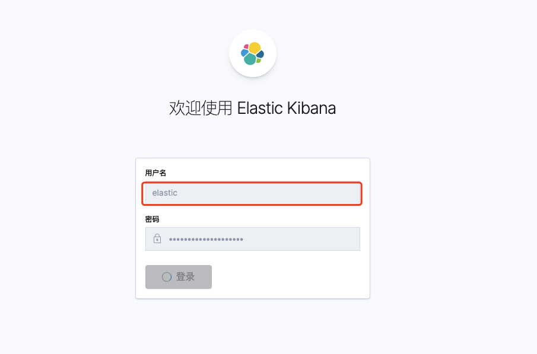

# Docker 部署 Kibana 7.8 说明

## 1. 编写创建 docker-compose.yml 文件

```shell
mkdir /home/docker/kibana -p
cd /home/docker/kibana
vim docker-compose.yml
```

```yaml
version: '3.5'
services:
  kibana:
    image: docker.elastic.co/kibana/kibana:7.8.0
    container_name: kibana
    ports:
      - 5601:5601
    environment:
      ELASTICSEARCH_URL: http://es-node-01:9200
      ELASTICSEARCH_HOSTS: http://es-node-01:9200
    volumes:
      - /home/data/kibana/kibana.yml:/usr/share/kibana/config/kibana.yml
    networks:
      - custom_net
networks:
  custom_net:
    external:
      name: elasticsearch-net
```

> 网络配置来自处   [Docker 部署 Elasticsearch 集群说明.md](../ElasticSearch/Docker 部署 Elasticsearch 集群说明.md) 

## 2. 创建宿主机映射目录

```shell
mkdir /home/data/kibana/ -p
```

## 3. 在创建的映射目录下编写自定义的 kibana.yml 文件

>  [Docker 部署 Elasticsearch 集群说明.md](../ElasticSearch/Docker 部署 Elasticsearch 集群说明.md) 

```shell
cd /home/data/kibana/
vim kibana.yml
```

* 明文配置

  ```yaml
  server.name: kibana
  server.host: "0.0.0.0"
  kibana.index: ".kibana"
  i18n.locale: "zh-CN"
  elasticsearch.username: kibana
  elasticsearch.password: q6RKWCngEj8cxG7XGTUL
  # xpack.monitoring.collection.enabled: true
  ```

> 关于开启监控和收集的这个配置 `xpack.monitoring.collection.enabled: true` ，不要在上述 yml 文件中配置，kibana 会启动失败，并抛出错误，具体参考配置  [Elasticsearch 7.8 文档配置说明.md](../../../项目文档/Elasticsearch 7.8 文档配置说明.md#使用Metricbeat收集监视数据) 

* 密文配置

  

## 4. 启动 Kibana

```shell
cd /home/docker/kibana
docker-compose up -d
docker-compose logs
```



> 注意这里登陆用户是  `elastic`，而非  `kibana` , 因为 ` kibana` 用户访问权限不够

